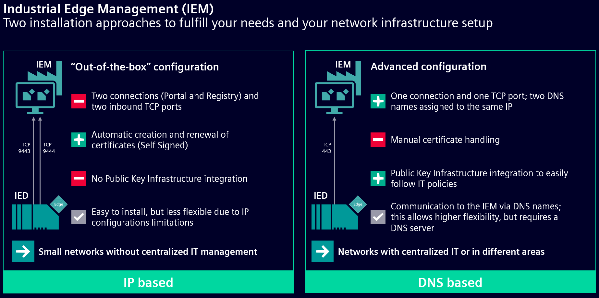
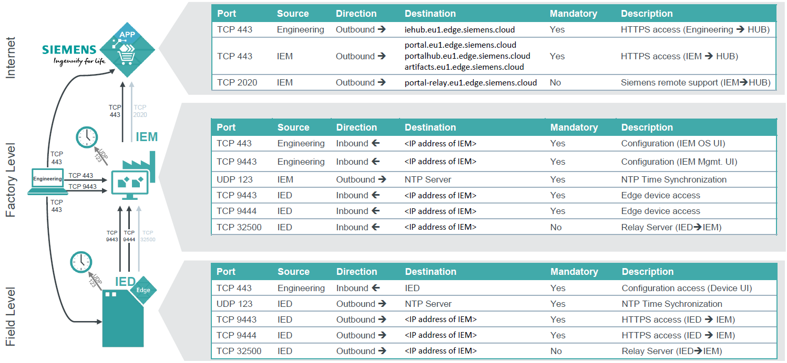
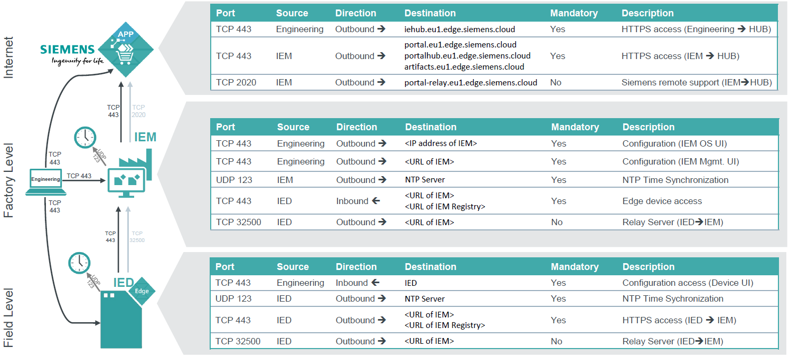
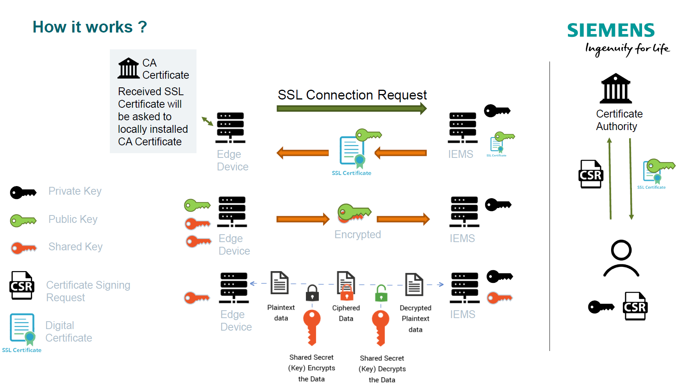
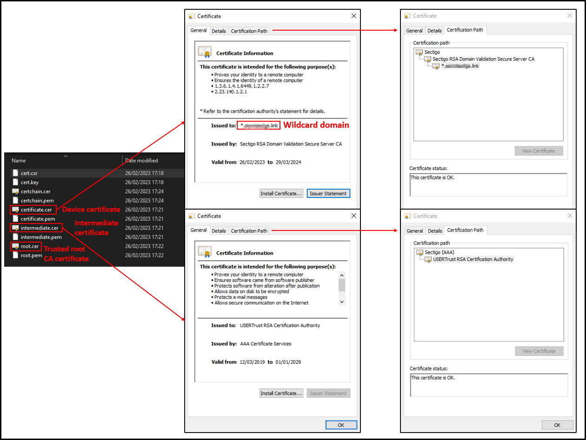
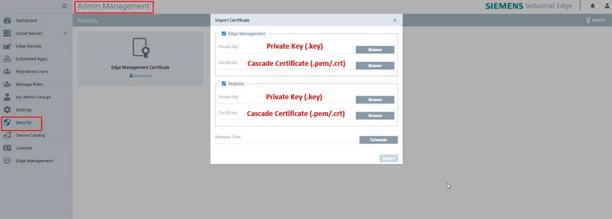
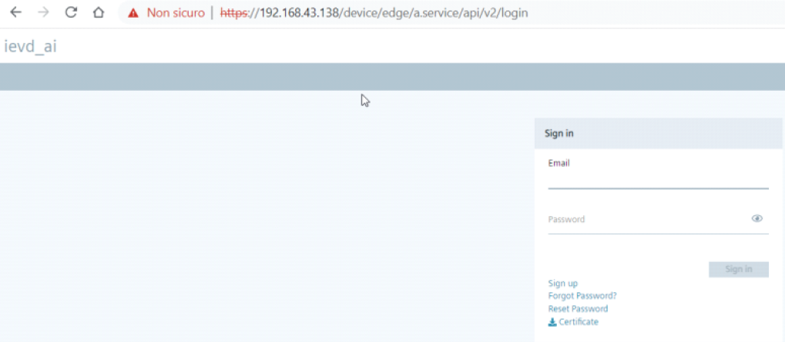

# SSL/TLS Certificates for Siemens Industrial Edge Management

- [SSL/TLS Certificates for Siemens Industrial Edge Management](#ssltls-certificates-for-siemens-industrial-edge-management)
  - [Introduction](#introduction)
  - [Industrial Edge Management setup information](#industrial-edge-management-setup-information)
    - [Industrial Edge Management deployment overview](#industrial-edge-management-deployment-overview)
      - [IP based IEM connectivity details](#ip-based-iem-connectivity-details)
      - [DNS based IEM connectivity details](#dns-based-iem-connectivity-details)
    - [Which IEM deployment option is recommended](#which-iem-deployment-option-is-recommended)
  - [How X.509 encryprion works](#how-x509-encryprion-works)
    - [X.509 basic concepts](#x509-basic-concepts)
  - [Generate your Certificate](#generate-your-certificate)
    - [Create a Certificate Signing Request](#create-a-certificate-signing-request)
      - [CSR and Private Key generation from configuration file using openssl](#csr-and-private-key-generation-from-configuration-file-using-openssl)
      - [CSR and Private Key generation using openssl](#csr-and-private-key-generation-using-openssl)
      - [CSR and Private Key generation using a website](#csr-and-private-key-generation-using-a-website)
    - [From the CSR to the Signed Certificate](#from-the-csr-to-the-signed-certificate)
    - [Build the Cascade Certificate](#build-the-cascade-certificate)
  - [Upload the Certificates and the Private Keys to your IEM](#upload-the-certificates-and-the-private-keys-to-your-iem)
  - [Appendix](#appendix)
    - [Create your CA and sign your Certificate](#create-your-ca-and-sign-your-certificate)
      - [Create your CA](#create-your-ca)
      - [Signing your certificate with your CA](#signing-your-certificate-with-your-ca)
  - [FAQ](#faq)
    - [How to remove the "Not Secure" warning in the browser visualization](#how-to-remove-the-not-secure-warning-in-the-browser-visualization)

## Introduction

This guide gives an overview of the possible configurations for the **Industrial Edge Management** and then provides comprehensive instructions for configuring **Industrial Edge X.509 certificates** to ensure secure data encryption.

## Industrial Edge Management setup information

The **SSL/TSL certificates** are requested during the **IEM setup** procedure, to allow secure connection. There are two options for setting up the Industrial Edge Management: **IP based IEM** and **DNS based IEM**. According to your needs and your infrastructure, you have to decide which setup fits better.
Keep in mind that the **IEM certificate** and the **Registry Certificate** can be [updated from the IEM web interface under the Security menu](#upload-the-certificates-and-the-private-keys-to-your-iem).

### Industrial Edge Management deployment overview

- **IP based IEM**:
  - All connection points for IEM are reachable over IP.
  - Requires more open ports on the firewalls.
  - Auto Generated Digital Certificate option possible.
- **DNS based IEM**:
  - All connection points for IEM are reachable over DNS.
  - Requires two Domain Name registration at the DNS Server.



#### IP based IEM connectivity details

- IEM is reachable via IP using dedicated ports:
  - **IEM-OS**: \<IP address of IEM\> at port:443.
  - **IEM**: \<IP address of IEM\> at port:9443.
  - **IEM-Registry**: \<IP address of IEM\> at port:9444.
  - **IEM-Relay Server**: \<IP address of IEM\> at port:32500.
- Certificates:
  - **Option 1**: Digital Certificates are generated by IEM automatically.
  - **Option 2**: Digital Certificates issued for the IP Address.



#### DNS based IEM connectivity details

- IEM is reachable via IP using dedicated ports:
  - **IEM-OS**: \<IP address of IEM\> at port:443.
  - **IEM**: \<URL of IEM\> at port:443.
  - **IEM-Registry**: \<URL of IEM Registry\> at port:443.
  - **IEM-Relay Server**: \<URL of IEM\> at port:32500.
- Certificates:
  - Digital Certificates issued for **two registered FQDN** or **wildcard** (better if signed by a trusted CA).



### Which IEM deployment option is recommended

- **IP based IEM**:
  - Fast and easy getting started without dealing with digital certificates.
  - No DNS Server available.
  - Local deployment without the need of managing complex IT networks.
- **DNS based IEM**:
  - High compatibility with complex IT infrastructures.
  - Firewall friendly: Only port 443 and 32500 are used.
  - Customer wants to reach IEM over Domain Names.
  - Certificates issued for FQDN names and registered on a DNS server.
  - IEM and Edge Devices are located in different areas and communicate via the public internet.

## How X.509 encryprion works

X.509 is a widely used standard for encoding digital certificates, and X.509 certificates are an essential component of secure communication on the internet. They are used to verify the authenticity of entities such as websites, individuals, or devices.



### X.509 basic concepts

- **Digital Certificate**:
  - A digital certificate is a data structure that binds a public key to an entity, such as a website, individual, or device.
  - The certificate includes the public key, information about the entity (e.g., the entity's name and organization), and a digital signature.
- **Certificate Authorities (CAs)**:
  - X.509 certificates are issued and signed by trusted entities known as Certificate Authorities (CAs).
  - CAs are responsible for verifying the identity of certificate applicants and ensuring the integrity of the certificate issuance process.
- **Certificate Generation Process**:
  - When an entity (e.g., a website) wants to obtain an X.509 certificate, it generates a key pair consisting of a public key and a private key.
  - The entity creates a Certificate Signing Request (CSR), which includes the public key and information about the entity..
  - The CSR is sent to a CA for validation. The CA verifies the entity's identity, checks the CSR's information, and ensures that the public key is valid.
  - If the validation is successful, the CA signs the entity's public key and information with its own private key, creating the X.509 certificate.
- **Structure of an X.509 Certificate**:
  - X.509 certificates have a hierarchical structure with fields and extensions. Common fields and extensions include:
    - Subject: Identifies the entity to which the certificate is issued.
    - Issuer: Identifies the CA that issued the certificate.
    - Public Key: Contains the public key of the entity.
    - Signature: Contains the digital signature of the certificate, generated by the CA's private key.
    - Validity Period: Specifies the certificate's start and expiration dates.
    - Key Usage: Defines how the public key can be used (e.g., for encryption or digital signatures).
    - Basic Constraints: Indicates whether the certificate can be used for signing other certificates.
    - Subject Alternative Name (SAN): Specifies alternative names for the entity (e.g., different domain names for a website).
- **Certificate Validation**:
  - When a user or application receives an X.509 certificate, they use the CA's public key to verify the certificate's digital signature.
    - If the signature is valid, the certificate is considered trusted.
    - The recipient checks the certificate's subject and issuer fields to determine if it can trust the certificate for the intended purpose.
    - The recipient verifies that the certificate has not expired.
    - The recipient may also check certificate revocation status using Certificate Revocation Lists (CRLs) or Online Certificate Status Protocol (OCSP).
- **Chain of Trust**:
  - X.509 certificates often form a chain of trust, with the Root CA at the top, intermediate CAs in the middle, and end-entity certificates at the bottom.
  - To trust an end-entity certificate, the recipient verifies the signatures of all intermediate CAs, and each CA is trusted by verifying its signature using the root CA's public key.
- **Revocation**:
  - X.509 certificates can be revoked before their expiration date due to various reasons, such as key compromise or changes in entity status.
  - Revocation information is provided in CRLs or through OCSP services, which can be checked to ensure that a certificate is still valid.

In summary, X.509 certificates play a crucial role in enabling secure communication on the internet by providing a way to verify the identity of entities and establish trust in public keys. They form the foundation for technologies like HTTPS, email encryption, and code signing.

## Generate your Certificate

This chapter will show you different methods to create and sign X.509 certificates that you can use with your **Industrial Edge** system.

### Create a Certificate Signing Request

The first step is to generate a **Certificate Signing Request (CSR)** that contains all the information required to generate the certificate that you will upload in your **Industrial Edge**; you will also need a **Private Key** that will be uploaded with your signed certificate.

There are different approaches that can be followed to create this files, here we will show you three possible alternatives.

> **Note 1:** A wildcard certificate is capable of validating multiple URLs ending with the same domain, thanks to the \* symbol placed before the domain (e.g., \*.myorganization.com).
> **Note 2:** In the CSR, in addition to location, state, email, etc., the most important parts are the **Common Name (CN)** and the **Subject Alternative Names (SAN)** because they contain the wildcard domain itself (e.g., *.myorganization.com).
> **Note 3:** Keep your private key SAFE , do not share with someone else. Do not LOST the private key, there is no way back for lost keys.

#### CSR and Private Key generation from configuration file using openssl

With this method you will need to fill a *.conf* file based on your deployment environment needs.
Below is an example configuration that can be used as a template for **DNS** and **IP** setup:

- **DNS** based:

  ```conf
  [req]
  distinguished_name = req_distinguished_name
  req_extensions = v3_req
  prompt = no
  [req_distinguished_name]
  C = IT
  ST = Italy
  L = Milan
  O = MyOrganization
  OU = MyOrganizationUnit
  CN = *.myorganization.it
  emailAddress = edge@myorganization.it
  [v3_req]
  keyUsage = digitalSignature, nonRepudiation, keyEncipherment, dataEncipherment
  extendedKeyUsage = serverAuth
  subjectAltName = @alt_names
  [alt_names]
  DNS = *.myorganization.it
  ```

- **IP** based:

  ```conf
  [req]
  distinguished_name = req_distinguished_name
  req_extensions = v3_req
  prompt = no
  [req_distinguished_name]
  C = IT
  ST = Italy
  L = Milan
  O = MyOrganization
  OU = MyOrganizationUnit
  CN = 192.168.1.180
  emailAddress = edge@myorganization.it
  [v3_req]
  keyUsage = digitalSignature, nonRepudiation, keyEncipherment, dataEncipherment
  extendedKeyUsage = serverAuth
  subjectAltName = @alt_names
  [alt_names]
  IP.1 = 192.168.1.180
  ```

Once you have configured your *.conf* file (referred to as *req.conf* in this guide), run the following **openssl** command:

```sh
openssl req -new -out yourdomainname.csr -newkey rsa:4096 -nodes -sha512 -keyout yourdomainname.key -config req.conf
```

This command will generate your **Private Key** and **CSR**.

#### CSR and Private Key generation using openssl

If you prefer to generate your **Private Key** and **CSR** files without using a configuration file, follow these steps:

  1. Generate the **Private Key**:

```sh
openssl genrsa -out iem-dns.key 4096`
```

  2. Generate the **CSR** file (edit the command based on your deployment needs):

```sh
# DNS based
openssl req -new -sha512 -key iem-dns.key -out iem-dns.csr \
–subj "/C=IT/ST=Milan/L=Milan/O=MyOrganization/OU=DI/CN=*.myorganization.it" \
-addext "subjectAltName=DNS:*.myorganization.it"

# IP based
openssl req -new -sha512 -key iem-dns.key -out iem-dns.csr \
–subj "/C=IT/ST=Milan/L=Milan/O=MyOrganization/OU=DI/CN=*.myorganization.it" \
-addext "subjectAltName=IP:192.168.1.180"
```

#### CSR and Private Key generation using a website

Numerous websites offer guidance on configuring and generating your certificate request. One such option is [Certificatetools](https://certificatetools.com).

### From the CSR to the Signed Certificate

Now that you have the **CSR** and the **Private Key**, you can obtain a **Signed Certificate**. You can follow one of these three methods to accomplish this task:

- Get the signed certificate from a **Public Trusted Authority**: there are many alternatives online like [ssltrust](https://www.ssltrust.com.au/ssl-certificates/wildcard), but you can freely choose the one that you prefer.
- Use your company internal **CA** that can generate and sign the certificate for you.
- Create a **CA** with a tool like **openssl** and sign your certificate. If you opt for this method, you can refer to the [Create your CA and sign your Certificate](#create-your-ca-and-sign-your-certificate) chapter of the [Appendix](#appendix).

This process results in three certificates:

- **Trusted Root CA (*root.cer*)**: it is the public certificate of the public authority.
- **Intermediate certificate (*intermediate.cer*)**: it works like a substitute for the **Trusted Root CA**, it represents a *trust chain* between the **Device certificate** and the **Trusted Root CA**.
- **Device certificate (*certificate.cer*)**: the certificate for your website/device.

> **Note:** Public Trusted Certificates are recognized by most of the operating systems (also docker containers), that makes it much easier to work with Edge. If Self Trusted Certificates are used, then you have to transfer the CA Certificate to the specific places manually for now.



### Build the Cascade Certificate

Once you obtained the **Device certificate** and the **Intermediate certificate**, you need to combine these files:


1. Open the **Device certificate** and the **Intermediate certificate** with a text editor.
2. Create a new **certchain.crt** (or **.pem**) file.
3. In the **certchain.crt**/**certchain.pem** file, copy the content of the **Device certificate** first and then the content of the **Intermediate certificate**.

> **Note 1:** When combining the two files, ensure there are no new lines between the content of the **Device certificate** and the content of the **Intermediate certificate**.
> **Note 2:** After you combined the two files, make sure there are no empty lines after the content of the **Intermediate certificate**.

## Upload the Certificates and the Private Keys to your IEM

The final section of this guide focuses on importing the **Device certificate** and its corresponding **Private Key** into the **Industrial Edge Management**:

 1. Log in to your **IEM**, go to the **IEM Portal Admin** and open to the **Security** section.
 2. Import the **signed certificates** and the associated **Private Keys** (as shown in the image below).



## Appendix

### Create your CA and sign your Certificate

#### Create your CA

To create your CA you will need to:

1. Generate your CA **Private Key**:

    ```sh
    openssl genrsa -des3 -out rootCA.key 4096
    ```

2. Generate your CA **Certificate**:

    ```sh
    openssl req -x509 -new -nodes -extensions v3_ca -key rootCA.key -sha512 -days 365 -out rootCA.crt -subj "/C=IT/ST=Milan/L=Milan/O=MyOrganization/OU=DI/CN=IndustrialEdgeSelfSignedCA"
    ```

> **Note:** You will be asked to enter a password during the CA Certificate creation.

#### Signing your certificate with your CA

To sign a certificate with your own CA, use the following command (modify it to suit your requirements):

```sh
openssl x509 -req -in iem-dns.csr -CA rootCA.crt -CAkey rootCA.key -CAcreateserial -out iem-dns.crt -days 365 -sha512 -extfile <(printf "subjectAltName=DNS:*.myorganization.it")
```

> **Note:** You will be asked to enter the password of your CA.

## FAQ

### How to remove the "Not Secure" warning in the browser visualization

In case your IE Device shows the **"Not Secure"** warning, as shown in the picture below, you can remove it importing the certificates in your browser following one of the methods shown below.



- Export the IED certificate and import it into all PCs that has to see the webpage as secure.
- Import the IEM certificate in the IED using **FQDN** (Fully Qualified Domain Name) and **DNS server**, for this procedure you will need to:
  - Use a DNS Server to associate the IP address of the IED to an FQDN.
  - Use the same domain of the Industrial Edge Machine configured in the FQDN of the IED (eg. in case the IEM domain is iem.mydomain.com, the FQDN associated to the IED has to be something like ied1.mydomain.com).
  - Have an IEM with a **Public Trusted** certificate.
  - Have the **Private Key** that was used during the activation procedure of the IEM.
  - Export the IEM certificate and import it as described [here in chapter "6.9 Importing Certificates"](https://support.industry.siemens.com/cs/ww/en/view/109814453)
